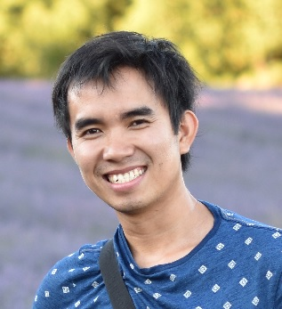

{:#mypicture}

[Mathematical Sciences Institute](http://maths.anu.edu.au/)  
The Australian National University  
Canberra, ACT, 2601, Australia

**Email:** `tran-thanh.ngo` at `cea` dot `fr`   
**Phone:** +33 6 52 55 87 46

### Research interests and background

Short introduction: 
My papers and preprints are on my [research page](/research), and my CV is available [here](assets/CV_Ngo_en.pdf).

### Teaching
For a link:  [MATH 1113](https://programsandcourses.anu.edu.au/course/math1113). 
To  [teaching page](teaching/).

### Current and upcoming activities
Older activities are listed on my [activities page](activities/).

{{ site.time }}

<ul>

<li>

<strong>{{ activity.display-date | markdownify | strip | remove: '
' | remove: '
' }}{{ activity.date | date: "%b %Y" }}:</strong>

{{ activity.content | markdownify | strip | remove: '
' | remove: '
'}}, {{ activity.location | remove: '
' | remove: '
'}}
</li>

</ul>

